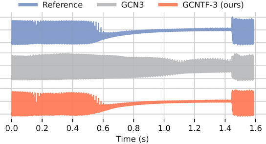

<div  align="center">

# GCN-TFiLM
**Modelling black-box audio effects with time-varying feature modulation**

[Paper](https://arxiv.org/abs/2211.00497) | [Webpage](https://mcomunita.github.io/gcn-tfilm_page/)

</div>

<div align="center">

</div>

## Setup

Install the requirements.
```
python3 -m venv .venv
source .venv/bin/activate
python3 -m pip install -r requirements.txt
```

## Dataset
You can find our dataset of fuzz and compressor effects on [Zenodo](https://zenodo.org/record/7271558#.Y2I_6OzP0-R). Once downloaded you can replace the ```data``` folder in this repo. You can also use your data which goes into 3 subfolders: ```test```, ```train``` and ```val```. Each folder should contain the input and target files (wav - 16bit) (one file only - it will be split into samples during training) and they should be named DEVICE-input.wav and DEVICE-target.wav (e.g., la2a-input.wav and la2a-target.wav).

## Training

If would like to re-train the models in the paper, you can run the training script which will train all the models one by one. The training results will be saved in the ```results``` folder.

```
python train.py
```

## Process Audio

To process audio using a trained model you can run the ```proc_audio.py``` script.

```
python proc_audio.py \
--input_file data/test/facebender-input.wav \
--output_file facebender-output.wav \
--model_file results/MODEL_FOLDER/model_best.json
--chunk_length 32768
```

## Credits
[https://github.com/Alec-Wright/Automated-GuitarAmpModelling](https://github.com/Alec-Wright/Automated-GuitarAmpModelling)

[https://github.com/csteinmetz1/micro-tcn](https://github.com/csteinmetz1/micro-tcn)

## Citation
If you use any of this code in your work, please consider citing us.
```    
@misc{https://doi.org/10.48550/arxiv.2211.00497,
    doi = {10.48550/ARXIV.2211.00497},
    url = {https://arxiv.org/abs/2211.00497},
    author = {Comunità, Marco and Steinmetz, Christian J. and Phan, Huy and Reiss, Joshua D.},
    keywords = {Sound (cs.SD), Artificial Intelligence (cs.AI), Machine Learning (cs.LG), Audio and Speech Processing (eess.AS), FOS: Computer and information sciences, FOS: Computer and information sciences, FOS: Electrical engineering, electronic engineering, information engineering, FOS: Electrical engineering, electronic engineering, information engineering},
    title = {Modelling black-box audio effects with time-varying feature modulation},
    publisher = {arXiv},
    year = {2022},
    copyright = {Creative Commons Attribution 4.0 International}
}
```
